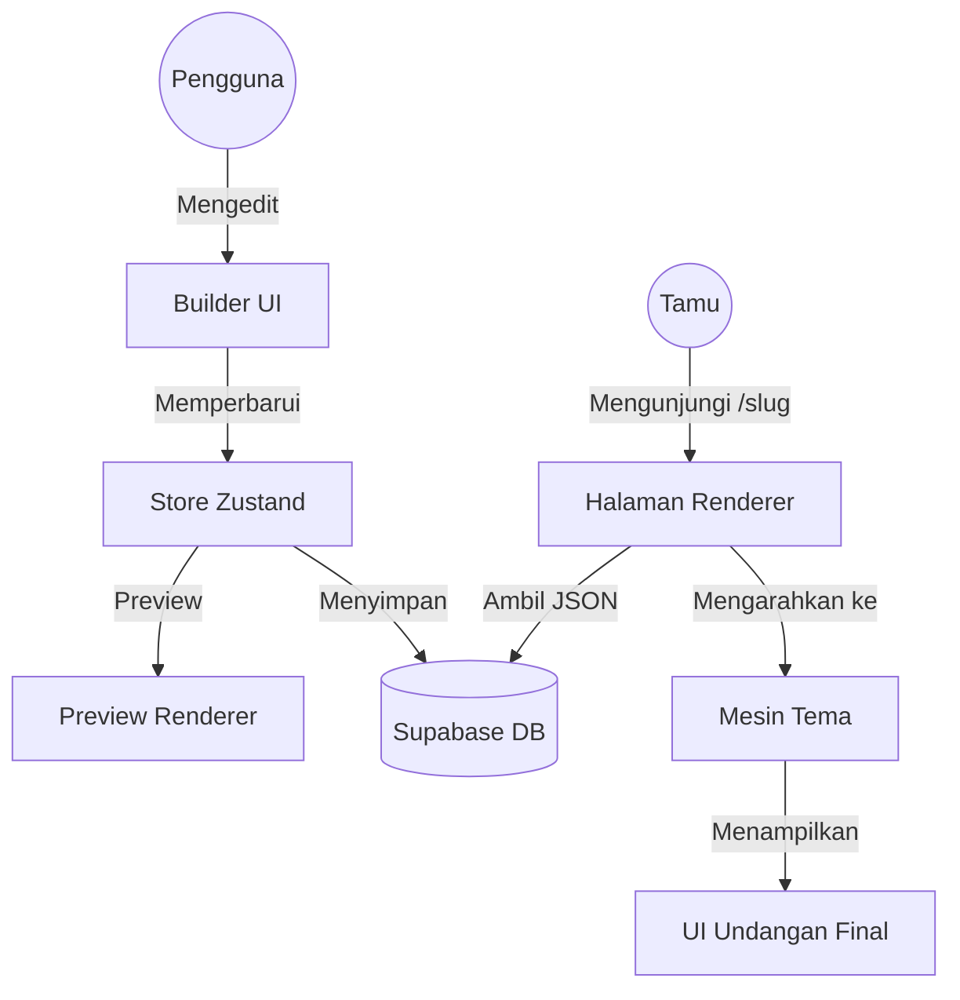

# Ikhtisar Arsitektur

Semat.invite dibangun dengan arsitektur modern dan modular yang memisahkan konten dari presentasi. Hal ini memungkinkan pengembangan tema yang fleksibel dan pengalaman pengeditan waktu nyata (real-time).

## 🧱 Konsep Inti

### Rendering Berbasis JSON

Filosofi inti Semat.invite adalah "Konten sebagai Data". Setiap konten, struktur, dan pengaturan undangan disimpan sebagai satu objek JSON di database Supabase.

- **Skema:** Tabel `invitations` berisi kolom `content` bertipe `jsonb`.
- **Struktur Data:** JSON ini mengikuti struktur yang telah ditentukan sebelumnya di `store/builderStore.ts` (antarmuka `InvitationData`).
- **Fleksibilitas:** Pendekatan ini memungkinkan kita untuk menambahkan bagian (section), bidang (field), atau pengaturan baru tanpa mengubah skema database.

### Alur Render (Render Flow)

Ketika pengguna mengunjungi tautan undangan publik (`/[slug]`):

1. **Ambil Data (Fetch):** Komponen halaman di sisi server mengambil data undangan (termasuk JSON `content`) dari Supabase berdasarkan slug.
2. **Identifikasi Tema:** `themeId` dari data undangan digunakan untuk mencari komponen tema yang sesuai di `themeRegistry`.
3. **Render:** Komponen Tema yang teridentifikasi dirender dengan menerima JSON `content` sebagai prop utama (`data`).

### Builder Real-Time

Modul Builder (`/app/(dashboard)/builder/`) memberikan pengalaman pengeditan berdampingan.

- **Manajemen State:** [Zustand](https://github.com/pmndrs/zustand) menangani state lokal dari undangan yang sedang diedit.
- **Sinkronisasi:** Saat pengguna membuat perubahan di `EditorPanel`, store Zustand diperbarui. `PreviewRenderer` mencerminkan perubahan ini secara instan dengan merender ulang undangan dengan state terbaru.
- **Persistensi:** Perubahan didebounce dan disimpan kembali ke Supabase untuk memastikan pengalaman pengguna yang lancar.

## 📡 Backend & Integrasi

### Supabase

- **PostgreSQL:** Meyimpan data undangan, informasi pengguna, dan daftar tamu.
- **Auth:** Menangani login aman (melalui Google OAuth).
- **Storage:** Menyimpan aset gambar dan musik yang diunggah.
- **RPC:** Digunakan untuk logika server-side khusus (misalnya, `increment_views`).

### Midtrans

Terintegrasi dengan Midtrans untuk menangani pembayaran. Webhook digunakan untuk memperbarui status `is_paid` undangan secara otomatis.

## 🗺 Diagram Sistem

